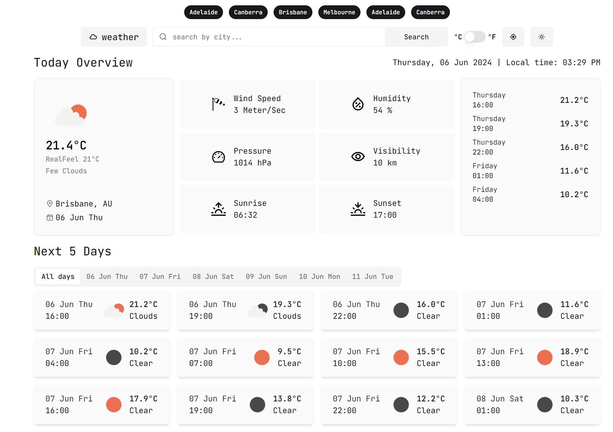

# React Weather App

This is a weather application built using React, Vite, shadcn/ui, OpenWeather API, and Luxon for date and time handling.

## Features

- View current weather conditions for various locations
- Display hourly and daily forecasts
- User-friendly interface with shadcn/ui components
- Easy customization and deployment using Vite

## Getting Started

To run this application locally, follow these steps:

1. Clone this repository to your local machine.
2. Navigate to the project directory.
3. Install dependencies using `npm install`.
4. Create a `.env` file in the root directory and add your OpenWeather API key:

   ```plaintext
   VITE_API_KEY=your_openweather_api_key_here
   ```

5. Run the application using `npm run dev`.
6. Open your browser and visit `http://localhost:3000` to view the app.

## Usage

- Enter the name of the city you want to check the weather for in the search bar.
- Press the search button or hit enter to see the current weather and forecast for that city.
- Scroll down to view hourly and daily forecasts.
- Display a list of recently searched cities.
- Click on a city name to view the weather and forecast for that city again.
- Enjoy the beautiful UI and stay informed about the weather!

## Screenshots



## Credits

- React: [https://reactjs.org/](https://reactjs.org/)
- Vite: [https://vitejs.dev/](https://vitejs.dev/)
- shadcn/ui: [https://github.com/shadcn/ui](https://github.com/shadcn/ui)
- OpenWeather API: [https://openweathermap.org/api](https://openweathermap.org/api)
- Luxon: [https://moment.github.io/luxon/](https://moment.github.io/luxon/)
